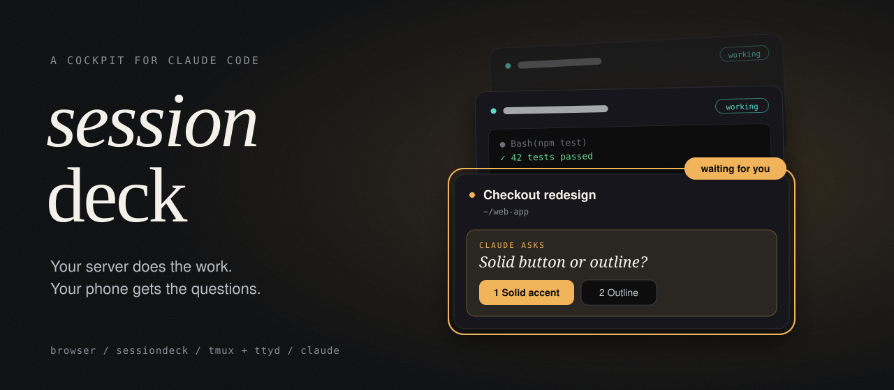
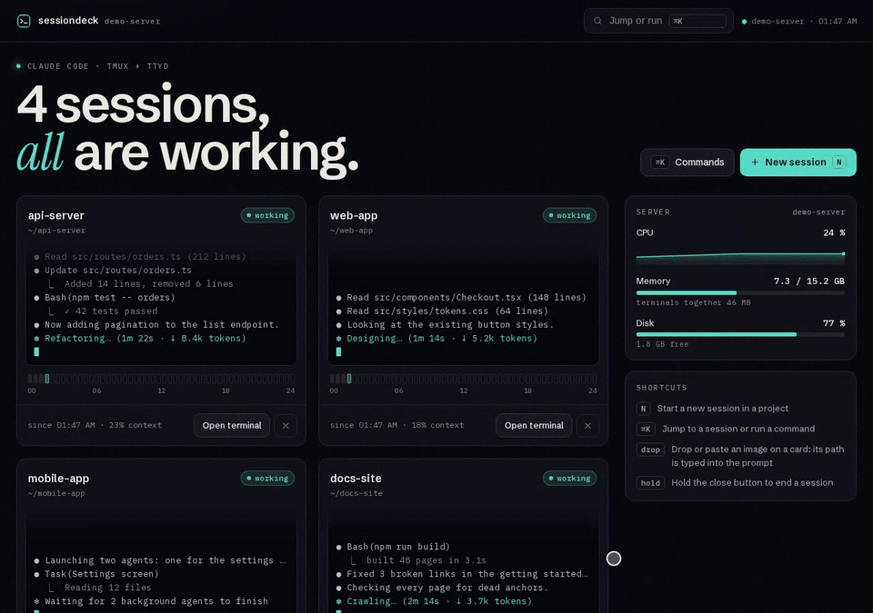
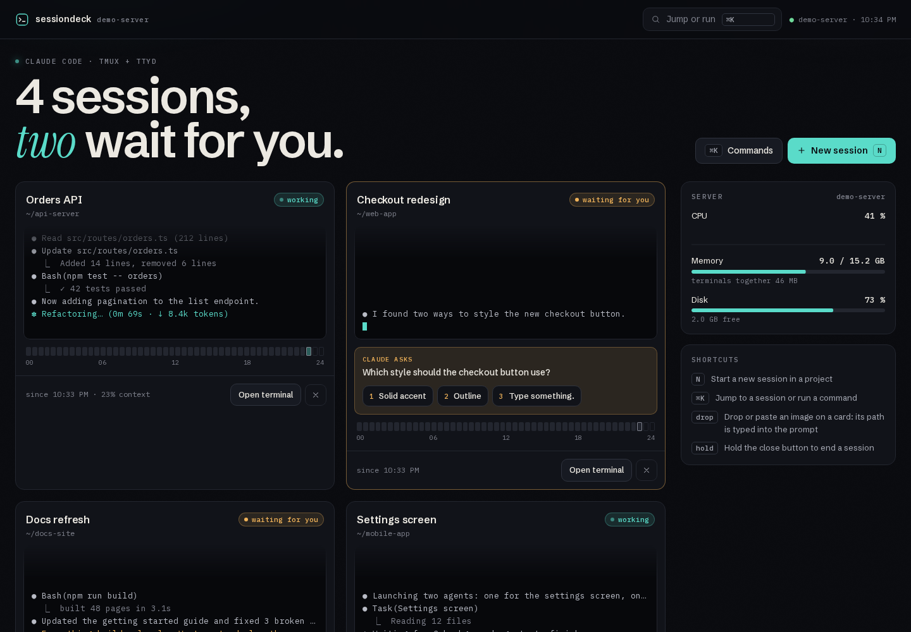
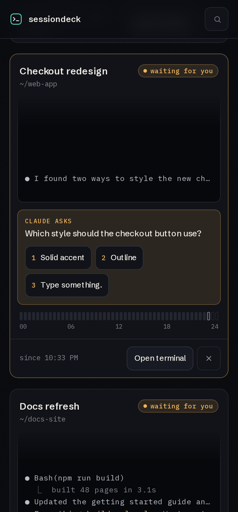
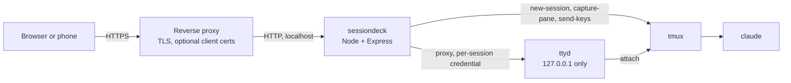

<p align="center">
  
</p>

<p align="center">
  <b>Run Claude Code on your own server. Steer it from any browser, even your phone.</b><br>
  sessiondeck starts Claude Code sessions in tmux, shows every one of them as a live card,
  tells you which one is waiting for you, and lets you answer its questions with one tap.
</p>

<p align="center">
  
</p>

<p align="center">
  <a href="#quick-start">Quick start</a> ·
  <a href="#how-it-works">How it works</a> ·
  <a href="#configuration">Configuration</a> ·
  <a href="#security">Security</a> ·
  <a href="#faq">FAQ</a> ·
  <a href="CHANGELOG.md">Changelog</a> ·
  <a href="https://github.com/crizex/sessiondeck/releases">Releases</a>
</p>

---

## Why

Claude Code is at its best on long tasks. Long tasks are exactly the ones you do not want to babysit
from one laptop that must not go to sleep. Put the sessions on a server instead, and you run into
the next problem: five SSH tabs, no idea which session finished, which one is stuck on a permission
prompt, and which one has been quietly waiting for an answer since lunch.

**sessiondeck is the cockpit for that setup.** One page, one card per session, and the one that
needs you is lit amber.

<p align="center">
  
</p>

## What you get

| | |
|---|---|
| **Live cards** | Every session shows its last terminal lines, a state (working, waiting for you, idle), context usage and a 24 hour activity strip. Polling the tmux pane, not guessing. |
| **Question cards** | When Claude asks something (a choice, a permission prompt), the options appear on the card as buttons. Tap one, and the key is pressed in the session. No terminal needed. |
| **Image drop** | Drag a screenshot onto a card, or paste it. sessiondeck stores it on the server and types its path into the Claude prompt. You press Enter. |
| **Real terminals** | "Open terminal" gives you the full session in the browser through ttyd. Sessions live in tmux, so you can also attach from SSH at the same time. |
| **Survives everything** | Close the browser, restart sessiondeck, lose the connection: the tmux sessions keep running and reappear. Even a crashed tmux server or a reboot: sessions come back with their conversation, see below. |
| **Updates in view** | The side panel shows when Claude Code or one of your enabled plugins has a newer version, and installs them with one button. |
| **Server at a glance** | CPU over the last 30 minutes, memory, disk, and how much RAM the terminals use together. |
| **Keyboard first** | `N` starts a session, `Cmd/Ctrl+K` opens the command palette. Ending a session needs a press and hold, so nothing dies by accident. |

<p align="center">
  
</p>

## How it works



- Every session is a tmux session running `claude` in a project folder. tmux is the source of truth.
- Every session gets its own ttyd on a local port, protected by a random credential that only
  sessiondeck knows. sessiondeck proxies `/terminal/<id>/` to it, including the WebSocket.
- Every 4 seconds sessiondeck reads the visible pane of each session and parses it: spinner line
  means working, a numbered menu means a question, silence means waiting or idle.
- Answers and image paths are delivered with `tmux send-keys`. Nothing is sent to any third party.

### Crash recovery

sessiondeck remembers the Claude conversation id of every session and the start time of the tmux
server. If sessions vanish because the tmux server died (a stray `tmux kill-server`, a reboot, an
out of memory kill), they are started again with `claude --resume <id>` in the same folder, and
their terminal comes back. A session that was in the middle of work gets a short message that it
was restored and should check what is really done before it continues. A session you ended
yourself with `/exit` stays off: the tmux server was still running when it disappeared.

### Updates

Every 30 minutes (and on demand from the command palette) sessiondeck runs
[`check-updates.js`](check-updates.js) as the Claude Code user: the installed `claude` version
against npm, and each enabled plugin against its marketplace. "Install updates" runs
`claude update` and `claude plugin update` for everything outdated and shows the result.

## Quick start

Requirements: Linux, Node.js 20 or newer, `tmux`, [`ttyd`](https://github.com/tsl0922/ttyd)
and [Claude Code](https://docs.anthropic.com/en/docs/claude-code) installed and logged in for the user that runs sessiondeck.

```bash
git clone https://github.com/crizex/sessiondeck
cd sessiondeck
npm install --omit=dev

cp .env.example .env
# set at least SESSIONDECK_PASSWORD and SESSIONDECK_ROOT
sed -i "s|^SESSIONDECK_PASSWORD=.*|SESSIONDECK_PASSWORD=$(openssl rand -base64 24)|" .env
nano .env

node --env-file=.env server.js
```

sessiondeck listens on `http://127.0.0.1:8765`. From your laptop, the quickest look is an SSH tunnel:

```bash
ssh -L 8765:127.0.0.1:8765 you@your-server
# then open http://localhost:8765 and log in with SESSIONDECK_USER / SESSIONDECK_PASSWORD
```

For real use, put it behind a reverse proxy with HTTPS (below) and run it as a service
with [`deploy/sessiondeck.service`](deploy/sessiondeck.service).

## Configuration

All settings are environment variables. [`.env.example`](.env.example) lists them with comments.

| Variable | Default | What it does |
|---|---|---|
| `SESSIONDECK_PASSWORD` | none, **required** | Login password, at least 12 characters. sessiondeck refuses to start without it. |
| `SESSIONDECK_USER` | `admin` | Login name. |
| `SESSIONDECK_HOST` | `127.0.0.1` | Address of the web UI. Only change it on a trusted network or with TLS in front. |
| `SESSIONDECK_PORT` | `8765` | Port of the web UI. |
| `SESSIONDECK_ROOT` | `~/projects` | Projects folder. Its subfolders are offered as projects; sessions can never start outside it, symlinks included. |
| `SESSIONDECK_TTYD_PORT_START` | `9100` | First local port for the per-session ttyd instances. |
| `SESSIONDECK_TTYD_BIN` | `ttyd` | ttyd binary. |
| `SESSIONDECK_CLAUDE_BIN` | `claude` | Claude Code binary. |
| `SESSIONDECK_RUN_AS` | empty | Only when sessiondeck runs as root: the user that owns tmux and runs Claude Code. |
| `SESSIONDECK_DATA_DIR` | `./data` | Session list, activity history and the last update check (created with mode 0700). |
| `SESSIONDECK_UPLOAD_DIR` | `<data dir>/images` | Where dropped images are stored. |
| `SESSIONDECK_NAME` | host name | Server name shown in the UI. |

## Behind a reverse proxy

sessiondeck speaks plain HTTP on localhost and expects a proxy to add TLS. With
[Caddy](https://caddyserver.com) that is three lines, certificates included:

```caddyfile
deck.example.com {
    reverse_proxy 127.0.0.1:8765
}
```

nginx works the same way, as long as WebSocket upgrades are passed through
(`proxy_http_version 1.1`, `Upgrade` and `Connection` headers) and the `Host` header is preserved.

**Recommended: a second lock.** sessiondeck hands out a shell on your server. Its password is the
minimum, not the ideal. Put one more factor in front, for example:

- **Client certificates.** Only devices with your certificate even see the login prompt.
  In Caddy: `tls { client_auth { mode require_and_verify  trust_pool file /etc/caddy/deck-ca.pem } }`.
- **A VPN** such as WireGuard or Tailscale, with sessiondeck bound to the VPN address only.
- **An identity-aware proxy** (Cloudflare Access, oauth2-proxy, Authelia).

## Security

sessiondeck gives whoever logs in a terminal as the user running Claude Code. Treat it like SSH.

What it does by default:

- **No default password.** It will not start without `SESSIONDECK_PASSWORD` (12+ characters).
  Credentials are compared in constant time.
- **Localhost only.** The UI binds to `127.0.0.1`; every ttyd binds to `127.0.0.1` and has its own
  random credential, so other local users cannot attach to a session port directly.
- **Everything behind auth,** including static files, the terminal proxy and WebSocket upgrades.
- **CSRF and cross-site WebSocket protection.** API writes need a custom header and a same-origin
  `Origin`; WebSocket upgrades from other origins are dropped.
- **Contained paths.** Session ids are validated, working directories are resolved with symlinks and
  must stay inside `SESSIONDECK_ROOT`, `--resume` only accepts a UUID, and no user input ever
  reaches a shell: tmux and ttyd get argument arrays.
- **No root needed.** Run it as the Claude Code user. Running as root requires an explicit
  `SESSIONDECK_RUN_AS`, and tmux then runs as that user.
- **Private state.** Session data (0600) and dropped images (0600, in a 0700 folder) are readable
  only by the service user. The login password is removed from the environment at startup, so
  tmux, Claude Code and ttyd never inherit it.

Known limits, so you can decide:

- Basic auth has no built-in rate limit. Use a long random password, and preferably one of the
  second locks above.
- The per-session ttyd credential is passed on the ttyd command line, which other local users can
  read in the process list unless `/proc` is mounted with `hidepid=2`. On a single-user server this
  does not matter.
- The state detection reads the screen. A future Claude Code release that changes its layout can
  make a card show the wrong state until the patterns in `pane.js` are updated.

Found a security issue? Please open a private security advisory on GitHub instead of a public issue.

## Desktop companion

Prefer a native window with tabs for all sessions? **[sessiondeck-desktop](https://github.com/crizex/sessiondeck-desktop)**
is the Windows companion: one tab per session over SSH, on the same server. sessiondeck works fine without it.

## Development

```bash
npm install
npm test          # node:test, no extra framework
```

The code is small on purpose: `server.js` (HTTP, tmux, ttyd), `pane.js` (reading the Claude Code
screen), `guard.js` (validation and auth helpers), `revive.js` (crash recovery rules),
`check-updates.js` (update check) and a dependency-free UI in `public/`.
The only runtime dependencies are `express` and `http-proxy`.

## FAQ

**Does this use the Claude API or my API key?**
No. It runs the regular `claude` CLI, logged in however you logged it in. The only network access of
sessiondeck itself is the update check: `npm view` for the Claude Code version and a fetch of your
plugin marketplaces, the same sources `claude` uses.

**Can several people use it?**
It is built for one person with many sessions. There is one login, and everyone who has it can see
and type into every session.

**What happens when I close the browser tab?**
Nothing. The session keeps running in tmux. Open the deck again and the card is still there.

**Can I attach from a normal terminal too?**
Yes. `tmux ls` shows the sessions by id, `tmux attach -t <id>` joins one. The browser and your SSH
terminal can be attached at the same time.

**Why does answering only work for numbered options?**
sessiondeck presses the number key of the option, exactly what you would do. For free text answers
("Type something") it selects the option and opens the terminal so you can type.

**macOS or Windows?**
The server needs Linux (it reads `/proc` and uses `ss`). The browser side works on anything,
including phones and tablets.

## Changelog

What changed in each version is in [CHANGELOG.md](CHANGELOG.md), downloads are on the
[releases page](https://github.com/crizex/sessiondeck/releases).

## License

MIT, see [LICENSE](LICENSE). Fonts in `public/fonts` (Schibsted Grotesk, IBM Plex Mono,
Instrument Serif) are licensed under the SIL Open Font License.

Not affiliated with Anthropic. Claude is a trademark of Anthropic.
